# Data Model ERD

## Purpose

This ERD translates the MVP data model baseline into a review-friendly relationship map.

Notes:

- It focuses on the main relational structure and skips some low-signal columns.
- History tables are separated from current-state tables conceptually, but linked where useful.
- Large retained artifacts live in local storage first in the lean pilot, with S3 as the growth path.

## Mermaid ERD

```mermaid
erDiagram
    USERS {
        uuid id PK
        string email
        string display_name
        string role
        boolean is_active
    }

    MAILBOXES {
        uuid id PK
        string gmail_address
        string display_name
        string gmail_profile_id
        string last_successful_history_id
        datetime last_polled_at
        boolean is_active
    }

    POLL_RUNS {
        uuid id PK
        uuid mailbox_id FK
        string trigger_source
        string status
        string history_id_start
        string history_id_end
        int messages_discovered
        int messages_enqueued
    }

    WORK_ITEMS {
        uuid id PK
        string work_type
        string status
        uuid mailbox_id FK
        uuid message_id FK
        uuid poll_run_id FK
        datetime scheduled_for
        int attempt_count
        int max_attempts
        datetime lease_expires_at
        json payload_json
    }

    MESSAGE_THREADS {
        uuid id PK
        uuid mailbox_id FK
        string gmail_thread_id
        string subject_canonical
        datetime latest_message_received_at
        uuid latest_message_id
    }

    MESSAGES {
        uuid id PK
        uuid mailbox_id FK
        uuid thread_id FK
        string gmail_message_id
        string gmail_history_id
        string rfc_message_id
        string from_address
        string subject
        datetime received_at
        string status
        string draft_state
        string priority
        boolean informational_only
        boolean reply_needed
        uuid assigned_category_id FK
        uuid assigned_subcategory_id FK
        string proposed_category_label
        string proposed_subcategory_label
        uuid latest_analysis_id
        uuid latest_prework_id
        uuid latest_draft_id
        uuid latest_sent_reply_id
    }

    MESSAGE_PARTICIPANTS {
        uuid id PK
        uuid message_id FK
        string participant_type
        string display_name
        string email_address
        int position_index
    }

    MESSAGE_HEADERS {
        uuid id PK
        uuid message_id FK
        string header_name
        string header_value
    }

    MESSAGE_ATTACHMENTS {
        uuid id PK
        uuid message_id FK
        string gmail_attachment_id
        string filename
        string mime_type
        int size_bytes
        boolean is_inline
    }

    MESSAGE_ARTIFACTS {
        uuid id PK
        uuid message_id FK
        string artifact_type
        string storage_uri
        string content_sha256
    }

    CATEGORIES {
        uuid id PK
        string name
        string default_draft_behavior
        boolean default_reply_needed
        boolean default_informational_only
        string priority_hint
        boolean is_active
    }

    SUBCATEGORIES {
        uuid id PK
        uuid category_id FK
        string name
        boolean is_active
    }

    TOPICS {
        uuid id PK
        string name
        boolean is_active
    }

    MESSAGE_TOPICS {
        uuid message_id FK
        uuid topic_id FK
    }

    DETECTED_QUESTIONS {
        uuid id PK
        uuid message_id FK
        string question_text
        int position_index
        string source_type
    }

    CATEGORY_RESPONSE_CONFIGS {
        uuid id PK
        uuid category_id FK
        string draft_behavior
        boolean auto_generate_draft
        string instructions_version
        string template_key
        string rag_mode
        boolean is_active
    }

    MESSAGE_ANALYSES {
        uuid id PK
        uuid message_id FK
        string analysis_version
        string analysis_source
        string model_name
        string prompt_version
        string confidence_tier
        string reason_summary
        uuid assigned_category_id FK
        uuid assigned_subcategory_id FK
        string proposed_category_label
        string proposed_subcategory_label
        string priority
        boolean informational_only
        boolean reply_needed
        uuid created_by_user_id FK
    }

    ANALYSIS_TOPICS {
        uuid analysis_id FK
        uuid topic_id FK
    }

    ANALYSIS_ARTIFACTS {
        uuid id PK
        uuid analysis_id FK
        string artifact_type
        string storage_uri
    }

    PREWORK_RECORDS {
        uuid id PK
        uuid message_id FK
        uuid source_analysis_id FK
        string status
        string retrieval_mode
        text outline_text
        text admin_notes
        string artifact_uri
        uuid created_by_user_id FK
    }

    PREWORK_CITATIONS {
        uuid id PK
        uuid prework_id FK
        uuid source_document_id FK
        uuid source_chunk_id FK
        string citation_label
        string source_url
        int precedence_rank
        int position_index
    }

    DRAFT_RECORDS {
        uuid id PK
        uuid message_id FK
        uuid source_analysis_id FK
        uuid source_prework_id FK
        int draft_version
        string draft_state
        string provenance
        string subject_line
        text body_text
        string artifact_uri
        uuid created_by_user_id FK
    }

    SOURCE_DOCUMENTS {
        uuid id PK
        string source_scope
        string title
        string version_label
        date effective_date
        string source_url
        string storage_uri
        int precedence_rank
        boolean is_active
    }

    SOURCE_CHUNKS {
        uuid id PK
        uuid source_document_id FK
        string chunk_key
        string section_label
        text chunk_text
        string embedding_ref
    }

    SENT_REPLIES {
        uuid id PK
        uuid message_id FK
        uuid draft_id FK
        string gmail_sent_message_id
        string gmail_thread_id
        text body_text
        datetime sent_at
        uuid sent_by_user_id FK
        string artifact_uri
    }

    NOTIFICATION_EVENTS {
        uuid id PK
        uuid message_id FK
        string channel
        string event_type
        string status
        string provider_message_id
    }

    AUDIT_EVENTS {
        uuid id PK
        uuid message_id FK
        string actor_type
        uuid actor_user_id FK
        string event_type
        string target_table
        uuid target_id
        text summary
        json before_json
        json after_json
    }

    MAILBOXES ||--o{ POLL_RUNS : runs
    MAILBOXES ||--o{ WORK_ITEMS : schedules
    MAILBOXES ||--o{ MESSAGE_THREADS : owns
    MAILBOXES ||--o{ MESSAGES : receives

    POLL_RUNS ||--o{ WORK_ITEMS : creates
    MESSAGE_THREADS ||--o{ MESSAGES : contains

    MESSAGES ||--o{ WORK_ITEMS : drives
    MESSAGES ||--o{ MESSAGE_PARTICIPANTS : has
    MESSAGES ||--o{ MESSAGE_HEADERS : stores
    MESSAGES ||--o{ MESSAGE_ATTACHMENTS : includes
    MESSAGES ||--o{ MESSAGE_ARTIFACTS : points_to
    MESSAGES ||--o{ MESSAGE_TOPICS : tagged_with
    MESSAGES ||--o{ DETECTED_QUESTIONS : contains
    MESSAGES ||--o{ MESSAGE_ANALYSES : analyzed_as
    MESSAGES ||--o{ PREWORK_RECORDS : prepared_as
    MESSAGES ||--o{ DRAFT_RECORDS : drafted_as
    MESSAGES ||--o{ SENT_REPLIES : responded_with
    MESSAGES ||--o{ NOTIFICATION_EVENTS : triggers
    MESSAGES ||--o{ AUDIT_EVENTS : audited_by

    CATEGORIES ||--o{ SUBCATEGORIES : has
    CATEGORIES ||--o{ CATEGORY_RESPONSE_CONFIGS : configures
    CATEGORIES ||--o{ MESSAGES : assigned_to
    SUBCATEGORIES ||--o{ MESSAGES : assigned_to

    TOPICS ||--o{ MESSAGE_TOPICS : linked_to
    TOPICS ||--o{ ANALYSIS_TOPICS : suggested_in

    MESSAGE_ANALYSES ||--o{ ANALYSIS_TOPICS : suggests
    MESSAGE_ANALYSES ||--o{ ANALYSIS_ARTIFACTS : points_to
    MESSAGE_ANALYSES ||--o{ PREWORK_RECORDS : feeds
    MESSAGE_ANALYSES ||--o{ DRAFT_RECORDS : informs

    PREWORK_RECORDS ||--o{ PREWORK_CITATIONS : cites
    PREWORK_RECORDS ||--o{ DRAFT_RECORDS : feeds

    SOURCE_DOCUMENTS ||--o{ SOURCE_CHUNKS : splits_into
    SOURCE_DOCUMENTS ||--o{ PREWORK_CITATIONS : sourced_in
    SOURCE_CHUNKS ||--o{ PREWORK_CITATIONS : excerpted_in

    DRAFT_RECORDS ||--o{ SENT_REPLIES : approved_as

    USERS ||--o{ MESSAGE_ANALYSES : creates
    USERS ||--o{ PREWORK_RECORDS : edits
    USERS ||--o{ DRAFT_RECORDS : creates
    USERS ||--o{ SENT_REPLIES : sends
    USERS ||--o{ AUDIT_EVENTS : performs
```

## Reading guide

The easiest way to read this model is in five slices:

1. Mail flow:
   `mailboxes -> poll_runs -> work_items -> message_threads/messages`

2. Message detail:
   `messages -> participants/headers/attachments/artifacts`

3. Workflow state:
   `messages -> work_items -> message_analyses -> prework_records -> draft_records -> sent_replies`

4. Taxonomy and classification:
   `categories/subcategories/topics` plus the join tables back to `messages` and `message_analyses`

5. Governance:
   `notification_events` and `audit_events`

## Current-state vs history

The key architecture pattern is:

- `messages` stores the current portal-visible state
- `work_items` stores lean-pilot background execution state
- `message_analyses`, `prework_records`, `draft_records`, `sent_replies`, and `audit_events` preserve history

That means the queue reads mainly from `messages`, while deeper review and audit drill into the related history tables.

## Pilot focus

For the first implementation slice, the most important part of this diagram is:

- `mailboxes`
- `poll_runs`
- `work_items`
- `message_threads`
- `messages`
- `message_participants`
- `message_headers`
- `message_attachments`
- `message_artifacts`
- `audit_events`

Everything else can be layered in after the first real Gmail-to-queue path is working.
